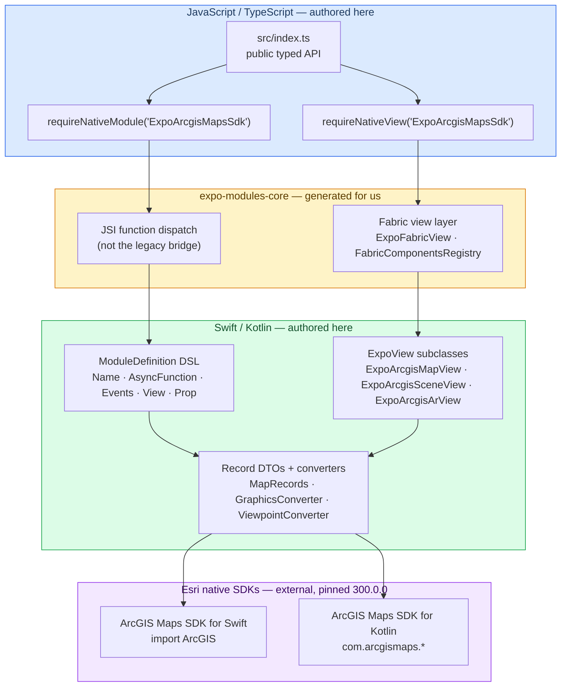
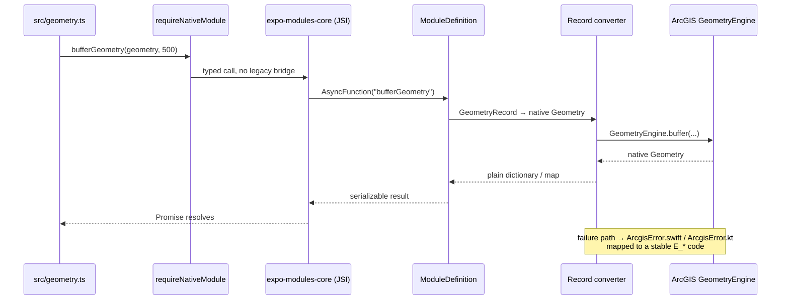

# Architecture

How `expo-arcgis-maps-sdk` is built: the binding layer between JavaScript and the native ArcGIS
SDKs, how the native ArcGIS dependency is delivered on each platform, the native view lifecycle
rules, the intended core/toolkit package boundary, and the example app + CI. It documents structure
and design decisions; per-feature status lives in the README support tables.

Every decision here is justified against [`CLAUDE.md`](../CLAUDE.md), the project's engineering
contract.

## Binding layer: Expo Modules API

This module uses the **Expo Modules API** on all three sides — Swift, Kotlin, and TypeScript — and
calls the native ArcGIS SDKs directly.

| Question                                      | Answer                                                            |
| --------------------------------------------- | ----------------------------------------------------------------- |
| Does it use Expo Modules API?                 | **Yes**, on all three sides — Swift, Kotlin, TypeScript.          |
| Does it hand-author Fabric components?        | **No.** No `codegenConfig`, no spec files.                        |
| Does Fabric run underneath at runtime?        | **Yes.** `expo-modules-core` generates the Fabric layer.          |
| Does it use the legacy React Native bridge?   | **No.** Expo Modules API dispatches over JSI.                     |
| Does it contain custom C++/JSI/ObjC++ glue?   | **No.** Zero `.h/.m/.mm/.cpp/.hpp` files in `ios/` or `android/`. |
| Does it call the native ArcGIS SDKs directly? | **Yes.** `import ArcGIS` (Swift), `com.arcgismaps.*` (Kotlin).    |

The short form: **no hand-written Fabric specs and no custom bridge layer, but Fabric and JSI are
both used — generated for us by `expo-modules-core` — and the native ArcGIS SDKs are called
directly.** Both platforms expose the same set of `AsyncFunction` declarations; that exact count
match is the mechanical check for the cross-platform parity rule in `CLAUDE.md`.

### The layer diagram

Where the module sits, and which layers are authored here versus generated.



The amber band is the key point: **Fabric and JSI are present, but they are a generated layer we
neither write nor maintain.** `expo-modules-core` supplies a generic adapter (`ExpoFabricViewObjC.mm`,
`FabricComponentsRegistry.cpp`) that plugs the `ModuleDefinition` DSL onto JSI and Fabric without
per-module code generation. The C++ is real — it is simply Expo's, not ours, which is precisely how
`CLAUDE.md` architecture rule 3 is satisfied while still running on the New Architecture.

### Why not pure React Native (Turbo Modules / Fabric)?

In pure React Native, the single Expo Modules API surface splits into **two** independent
mechanisms, both driven by React Native Codegen — a Turbo Module and a Fabric Native Component — and
both generate **C++ / Objective-C++** on iOS. An implementation class must conform to a generated
Objective-C++ protocol, so a Swift-first module needs a hand-written `.mm` wrapper.

That collides directly with `CLAUDE.md` architecture rule 3:

> Do not add C++, JNI, Objective-C++ or custom JSI bindings for ArcGIS features.

The ArcGIS Maps SDK for Swift is a Swift-first API whose types (`Polygon`, `Viewpoint`,
`GeometryEngine`) do not bridge cleanly to Objective-C. Wrapping it in Objective-C++ to satisfy
codegen would mean writing the exact layer the contract forbids. **Expo Modules API is doing real
work here:** it generates the Fabric/JSI plumbing so the authored surface stays Swift + Kotlin only.

| Dimension               | Expo Modules API (current)                        | Pure RN Turbo/Fabric                             |
| ----------------------- | ------------------------------------------------- | ------------------------------------------------ |
| Languages authored      | Swift + Kotlin + TS                               | Swift + Kotlin + TS **+ ObjC++/C++**             |
| Codegen step            | none                                              | required, in the build graph                     |
| Nested DTO conversion   | `Record` protocol — handles deep nesting          | stricter codegen types; awkward for deep nesting |
| Prop diffing            | per-prop closure, called only on change           | whole props struct, hand-diffed                  |
| Async ergonomics        | `AsyncFunction … Coroutine`; Swift `async` native | manual promise plumbing                          |
| Cross-platform symmetry | one DSL, mechanically comparable                  | two codegen surfaces, drift more likely          |
| Ecosystem coupling      | requires Expo (peer dependency)                   | none                                             |
| `CLAUDE.md` rule 3      | **satisfied**                                     | **violated**                                     |

> **Note on Nitro Modules.** [Nitro Modules](https://github.com/mrousavy/nitro) sits between the
> two: Expo-like ergonomics, first-class Swift/Kotlin support, its own JSI code generator, no Expo
> dependency. It is the realistic path if this module ever needed to drop Expo Modules API without
> writing Objective-C++. Recorded so the option is not lost; not adopted.

### How a call flows

A representative round trip — `bufferGeometry`, which exists on both platforms.



The `Record` converters (`MapRecords.swift`, `dto/MapRecords.kt`) are the boundary. **No native
ArcGIS object crosses into JavaScript** (`CLAUDE.md` architecture rule 5). Failures collapse into the
eight stable codes in `src/types/errors.ts`:

`E_NOT_CONFIGURED` · `E_INVALID_ARGUMENT` · `E_MAP_LOAD_FAILED` · `E_LAYER_LOAD_FAILED` ·
`E_AUTHENTICATION_FAILED` · `E_JOB_CANCELLED` · `E_UNSUPPORTED` · `E_NATIVE_FAILURE`

Web is a first-class _unsupported_ target rather than a crash: every method in
`src/ExpoArcgisMapsSdkModule.web.ts` throws `E_UNSUPPORTED`.

## Native dependency & the config plugin

Expo Modules API binds the module, but it does **not** deliver the ArcGIS SDKs. Those arrive by two
different mechanisms, which is why the config plugin exists. Both platforms pin the same ArcGIS
release, `300.0.0`, with no version ranges (`CLAUDE.md` native dependency policy).

| Platform    | How ArcGIS resolves                                                                                                                                       | Consumer effort            |
| ----------- | --------------------------------------------------------------------------------------------------------------------------------------------------------- | -------------------------- |
| **Android** | An ordinary Maven coordinate `com.esri:arcgis-maps-kotlin:300.0.0`. `android/build.gradle` declares it; the config plugin adds Esri's Maven repository.   | Automatic after the plugin |
| **iOS**     | A **Swift Package / binary xcframework**, not a CocoaPod, so an Expo module podspec cannot declare it. The config plugin wires it into the Xcode project. | Automatic after the plugin |

### What the config plugin does

Authored in TypeScript under `plugin/src`, compiled to `plugin/build` (`yarn build:plugin`), and
exposed through the root `app.plugin.js`. Wrapped in `createRunOncePlugin`; every transform is
idempotent, so repeated `expo prebuild` runs produce no duplicates.

| Platform | Action                                                               | Mechanism                                                 |
| -------- | -------------------------------------------------------------------- | --------------------------------------------------------- |
| Android  | Add Esri's Maven repository                                          | `withArcgisAndroid` + `gradle.ts`                         |
| Android  | Raise `minSdkVersion` → 28, `compileSdkVersion` → 36 (only if lower) | `withGradleProperties` + `ensureMinimumGradleProperty`    |
| Android  | Pin the Kotlin Gradle plugin to a compatible version                 | `gradle.ts` (see note below)                              |
| iOS      | Raise the deployment target → 17.0 (only if lower)                   | `withPodfileProperties` + `ensureMinimumDeploymentTarget` |
| iOS      | Wire **both** ArcGIS Swift Packages into the Xcode project           | `withArcgisPodfile` Podfile `post_install` (see below)    |

Design choices, from `CLAUDE.md`:

- **Never lower a consumer setting.** The `ensureMinimum*` helpers only raise; equal or higher values
  are left untouched.
- **Fail loudly on unexpected shapes.** The Gradle repo insert throws an actionable error if the
  expected block is missing, rather than guessing.
- **Pure, testable transforms.** File edits are string-in/string-out functions unit-tested with Jest
  against representative fixtures (`plugin/src/__tests__`).

> **Kotlin version note.** ArcGIS Maps SDK for Kotlin 300.0 ships Kotlin metadata 2.3.0, which Expo
> SDK 57 / RN 0.86's default Kotlin 2.1.x cannot read. The plugin pins the Kotlin Gradle plugin to
> `2.2.21`, which reads 2.3.0 metadata and stays under Expo's `< 2.3.0` support ceiling.

### The iOS Swift Package wiring (why it takes three pieces)

The ArcGIS Maps SDK for Swift ships as Swift Packages, which CocoaPods and autolinking cannot pull.
`withArcgisPodfile` injects a Podfile `post_install` hook that wires them into the consumer's Xcode
project using the reliable `Xcodeproj` Ruby API (not the fragile JS `xcode` library). A fresh
consumer builds iOS with **no manual Xcode step**.

Three pieces are required, because `xcodebuild` only resolves Swift package references reachable from
the **app** project and ignores references that live in `Pods.xcodeproj`:

1. **Toolkit** (`arcgis-maps-sdk-swift-toolkit`) → Pods project + the `ExpoArcgisMapsSdk` pod target
   (product linked). The pod does `import ArcGISToolkit`, and gets `import ArcGIS` transitively.
2. **Core ArcGIS** (`arcgis-maps-sdk-swift`, the binary xcframework) → the app project + app target
   (product linked), reached via `installer.aggregate_targets`.
3. **Toolkit again** → the app project as a **reference only** (no product link). This is what lets a
   headless `xcodebuild` resolve the toolkit at all. Linking the toolkit product to the app target as
   well would statically link it twice (once via the pod) and fail with thousands of duplicate
   symbols — hence reference-only here.

This split is independent of the binding-layer choice — it would be identical under Turbo Modules.
Android has no equivalent problem; it is an ordinary Maven coordinate.

## Native view lifecycle & threading

The native views (`ExpoArcgisMapView`, `ExpoArcgisSceneView`, `ExpoArcgisArView`) host the ArcGIS
views inside an `ExpoView` subclass:

|           | iOS                                                                            | Android                                                                             |
| --------- | ------------------------------------------------------------------------------ | ----------------------------------------------------------------------------------- |
| View      | SwiftUI `MapView`/`SceneView` in a `UIHostingController` inside the `ExpoView` | `com.arcgismaps.mapping.view.MapView`/`SceneView` added as a subview                |
| Load      | `try await map.load()`                                                         | `map.load()` (suspend) → `Result`                                                   |
| Lifecycle | cancel the load `Task` on disposal; drop the hosting controller                | `lifecycle.addObserver(view)`; cancel the view `CoroutineScope`, remove on disposal |

Lifecycle and threading rules applied from `CLAUDE.md`:

- Create ArcGIS view objects on the main thread.
- Retain observation/listener tokens explicitly; remove them on disposal.
- Cancel Swift `Task`s / Kotlin coroutines during disposal; ignore stale completions after disposal
  (guard with an `isDisposed` flag / cancelled scope).
- Release map/view references on unmount; never rely on JS GC.
- Apply **minimal native diffs** on prop change (e.g. only rebuild the `Map` when the basemap/web-map
  id actually changes), not a full rebuild per render. Reconcile layers and graphics by stable ID.

Events are converted to stable, serializable payloads by a small `mapError` helper per platform; raw
native exception text and any credentials are never forwarded. High-frequency events (viewpoint,
tracking state) are throttled — only meaningful changes cross the boundary.

## Core vs Toolkit boundary

Esri ships the ArcGIS Maps SDK as two separately-versioned artifacts on each platform: the **core
runtime** (`arcgis-maps-sdk-swift` / `-kotlin`) and **UI components** (`-toolkit`, SwiftUI / Jetpack
Compose built on the core). The part worth mirroring is the **boundary and dependency direction**,
not the toolkit's native implementation.

The intended split — **recorded, deliberately deferred** (the repo stays a single root-level Expo
module until the gate below is met):

```text
expo-arcgis-maps-sdk        Core. Native views + async commands + events + typed DTOs.
                            Owns all Swift/Kotlin code and the config plugin.
        ▲
        │ depends on (public API only)
        │
expo-arcgis-maps-toolkit    Optional UI. Pure React/TypeScript components built on the
                            SDK's public ref + events. No native code, no config plugin.
```

Rules: the toolkit depends on the core, **never the reverse**; it talks to the core only through the
documented public API (ref, props, events); and the core must remain fully usable **without** the
toolkit installed.

**How toolkit components are built — RN-by-default, native-wrap by exception.** A toolkit component
is React UI rendered on top of the core's views, driven by the public ref and events — one identical
cross-platform look, no new native surface. A small set of Esri toolkit components (popup,
authenticator, floor filter, utility-network trace) are recorded as _candidates_ where a native
wrapper may later beat an RN reimplementation; that is decided case-by-case, never as the default,
and requires documenting the SwiftUI-vs-Compose platform difference.

**Why deferred.** A pure-RN toolkit package is cheap to extract at any time (peer dep on the SDK), so
deferring costs almost nothing; there are zero toolkit consumers today; and the real blocker for
every widget is core API completeness, which packaging does nothing to advance. The split lands as
its own milestone once (1) the 2D foundation is stable on both platforms, (2) a few toolkit widgets
are validated against the stable public API, and (3) the public ref/event surface is no longer
churning.

## Example app & CI

The [`example/`](../example) app is the integration host. It exercises every public feature on real
iOS and Android builds through deterministic demo screens grouped by capability, and reproduces the
expected **success and failure** paths for each API. It resolves the local package through
`metro.config.js` and references the config plugin via `"plugins": ["../app.plugin.js"]`, so
`yarn build:plugin` must run before `expo prebuild`. See [`example/README.md`](../example/README.md)
to run it, and [`CONTRIBUTING.md`](../CONTRIBUTING.md) for driving it on a simulator/emulator.

CI (`.github/workflows/ci.yml`) runs on push/PR: install → `yarn build:plugin` → **`yarn run check`**
(typecheck ×2, lint, prettier, jest). It uses `yarn run check`, never `yarn check` (a Yarn 1
builtin). Publishing is a separate tag-triggered workflow (`.github/workflows/release.yml`).
